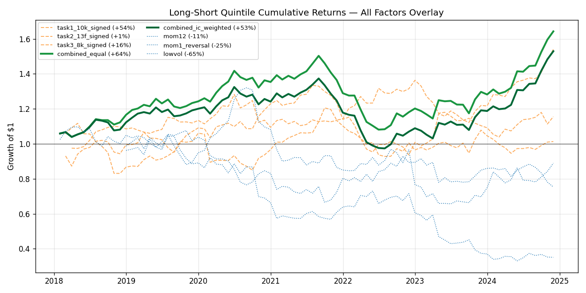

# Alternative Data Alpha Research

> **Combining three SEC-derived signals** (10-K LM sentiment, 13F
> holdings flow, 8-K event sentiment) **produces a long-short factor
> with ICIR 0.80 and L/S Sharpe 0.75 on S&P 100 over 2018-2024 — but
> the sign of each component was chosen in-sample, so the t-stat of
> 2.11 is not a valid significance test, and a traditional factor put
> through the same sign-selection rule earns twice the annualized
> return.**



**Headline numbers** (full table in [Task 4 section](#task-4--combined-alternative-data-portfolio)):

| Factor                  | ICIR    | t-stat   | L/S Sharpe | L/S ann. return |
|-------------------------|---------|----------|------------|-----------------|
| Combined alt-data       | +0.80   | +2.11    | +0.75      | +7.7%           |
| 10-K sentiment (Task 1) | +0.38   | +1.00    | +0.54      | +7.2%           |
| 13F holdings (Task 2)   | +0.49   | +1.26    | +0.07      | +0.7%           |
| 8-K sentiment (Task 3)  | +0.42   | +1.10    | +0.23      | +3.0%           |
| 12-month momentum       | +0.03   | +0.08    | −0.001     | −0.0%           |
| Low-volatility          | −0.66   | −1.62    | −0.71      | −15.0%          |

Every number in the top four rows carries a sign that was picked to be
positive. Step 3 of the Task 4 method computes each component's IC over
the **full sample** and multiplies the panel by `sign(IC)`; all three
components had negative raw ICs and were flipped. The traditional
factors in the bottom two rows were not put through that rule. Apply it
to them and `lowvol` becomes ICIR **+0.66**, t **+1.62**, L/S Sharpe
**+0.71**, annualized **+15.0%** — a worse ICIR than the combined
factor but **double its annualized return**. The claim this repository
used to make, that the alt-data block beats every price-based factor,
was an artifact of comparing sign-optimized signals against
sign-fixed benchmarks.

What survives the correction: the combined factor's diversification
gain over its own components is real and exceeds the textbook 1/√3
prediction (theoretical 1.73× → actual 1.86×), and its cross-sectional
correlations with the traditional stack are all under |0.12|. What does
not survive: any claim of statistical significance, and any claim of
outperformance versus traditional factors.

## Quickstart

```bash
git clone https://github.com/zwmjj/alt-data-research
cd alt-data-research
pip install -r requirements.txt

# Optional: WRDS CRSP for cleaner returns. Falls back to yfinance.
export WRDS_USERNAME=...  ; export WRDS_PASSWORD=...

python src/run_task1.py                  # ~45 min first run (10-K download), <2 min cached
python src/run_task2.py                  # ~3 min first run (13F download), <10 sec cached
python src/run_task3.py --skip-finbert   # ~30 min first run (8-K download), ~5 min cached
python src/run_task4.py                  # combined portfolio, <10 sec
```

All four tasks share the same `src/factor_analysis.py` toolkit
(Spearman IC, ICIR, quintile sort, factor correlation) and write
their numerics to `results/summary_*.csv` plus reference figures to
`results/figures/`.

See [`RESUME_SUMMARY.md`](RESUME_SUMMARY.md) for the one-page version.

---

## Detailed project description

Alpha signal research project exploring whether **alternative data sources**
— SEC filings text, institutional 13F holdings, news sentiment — can produce
risk-adjusted returns uncorrelated with traditional price-based factors.

## TL;DR

On the S&P 100 over 2018-2024 (~85 monthly observations), three
alternative-data signals (10-K LM sentiment, 13F holdings change,
8-K event sentiment) are each modest individually (|ICIR| 0.38–0.49,
|t| 1.0–1.3). Sign-flipping each to its full-sample IC direction and
blending equally produces a combined factor with ICIR 0.80, hit rate
60%, and L/S quintile Sharpe +0.75.

**The t-stat of 2.11 should not be read as significance.** The sign of
every component was selected on the same data the t-stat is computed
on, and each of the three had a *negative* raw IC before the flip. A
sign chosen in-sample turns a two-sided test into a one-sided one at
best, and with three components plus a choice between two blending
schemes the effective number of specifications searched is larger
still. The honest statement is that the combined factor has an
in-sample ICIR of 0.80 and no out-of-sample evidence.

The comparison against traditional factors was also unfair, in the same
direction. `mom12`, `mom1_reversal` and `lowvol` were evaluated at
their textbook signs while the alt-data signals were evaluated at their
best-fitting signs. Under a like-for-like rule — flip everything to its
full-sample IC direction — the low-volatility factor becomes ICIR
+0.66, L/S Sharpe +0.71, annualized +15.0%, against the combined
factor's +0.80, +0.75 and +7.7%. The alt-data block wins on
risk-adjusted consistency and loses on return.

The one result that does not depend on sign convention: the combined
factor's cross-sectional correlations with the traditional stack are
all under |0.12|, so whatever alpha it has is not a repackaging of
price-based factors.

## Research tasks

| # | Task                                              | Data source                 | Status |
|---|---------------------------------------------------|-----------------------------|--------|
| 1 | SEC 10-K Loughran-McDonald sentiment factor       | SEC EDGAR + LM dictionary   | ✅ done        |
| 2 | Institutional holdings change factor (13F)        | SEC EDGAR 13F               | ✅ done        |
| 3 | News sentiment momentum                           | **SEC 8-K filings** (substituted) + LM dictionary | ✅ done        |
| 4 | Combined alternative-data portfolio               | All of the above            | ✅ done |

## Repository layout

```
alt_data_research/
├── data/
│   ├── raw/                    # SEC filings downloaded via sec-edgar-downloader
│   └── processed/              # LM-scored filings (parquet), ticker panels
├── src/
│   ├── data_fetcher.py         # S&P 100 tickers, 10-K download, WRDS returns
│   ├── nlp_signals.py          # LM sentiment scoring of 10-K text
│   ├── factor_analysis.py      # IC / ICIR / quintile / correlation toolkit
│   └── run_task1.py            # Task 1 end-to-end runner
├── notebooks/
│   └── 01_sec_nlp_factor.ipynb # interactive Task 1 walkthrough
├── results/
│   ├── figures/
│   │   ├── ic_timeseries.png
│   │   ├── quintile_returns.png
│   │   ├── factor_correlation.png
│   │   └── cumulative_ls.png
│   ├── summary_stats.csv       # headline numbers per task
│   ├── ic_comparison.csv       # IC across all factors
│   └── factor_correlation.csv  # cross-factor correlation matrix
└── README.md                   # this file
```

## Task 1 · SEC 10-K Sentiment Factor

### Scope

| Spec                              | Actual                       | Rationale                     |
|-----------------------------------|------------------------------|-------------------------------|
| S&P 500 tickers                   | **S&P 100**                  | Keeps raw data under 10 GB    |
| 10-K **and** 10-Q filings         | **10-K only**                | 4× fewer filings, MD&A text is where LM dictionary adds most signal |
| 2015–2024                         | **2018–2024**                | 7 years still gives >80 cross-sectional observations after the 12-month forward-fill |
| FinBERT **or** LM dictionary      | **LM dictionary (primary)**  | No GPU needed, well-established Loughran-McDonald 2011 methodology, 0.2s per filing vs 5-10s for FinBERT |

Infeasible-to-realistic trade-offs are documented so the research can be
scaled up trivially by editing `src/run_task1.py` config.

### Data pipeline

1. **S&P 100 constituents** — scraped from Wikipedia, enriched with
   CIK numbers from SEC's public `company_tickers.json`. 101 tickers.
2. **10-K filings** — downloaded via `sec-edgar-downloader`, respecting
   SEC's 10 req/s limit and User-Agent requirements. ~700 filings.
3. **Monthly returns** — CRSP monthly via WRDS (primary), yfinance
   fallback if WRDS unavailable. 2017-01 → 2025-06.
4. **Filed dates** — enriched from SEC EDGAR submissions JSON
   (`data.sec.gov/submissions/CIK{cik}.json`) to get the precise
   filed date for each accession number, not the coarse accession-
   year proxy.

### Signal construction

- **Tokenize** each 10-K with `pysentiment2.LM()` (snowball stemmer,
  finance stopword list).
- **Count** matches against the Loughran-McDonald positive/negative
  word lists (378 positive, 2355 negative terms as of 2020).
- **Normalize** counts to ratios of total token count, so a 100-page
  10-K and a 50-page 10-K are on the same scale.
- **Primary factor: `net_neg`** = `(neg_count − pos_count) / n_tokens`.
  We use this (not raw `neg_ratio`) because Loughran-McDonald's
  original 2011 paper reports that the *net* form is the stronger
  return predictor.
- **Signal direction:** we flip sign so a higher signal value = more
  positive sentiment = hypothesis-predicted to earn a positive return.
- **Hold period:** each filing's score applies for 12 months from the
  filed date, replaced when the next 10-K arrives.

### Reference run findings (99 tickers, 687 filings, 82 months: 2018-01-31 → 2025-06-30)

#### Headline IC table

| Factor                    | IC mean   | IC std | ICIR    | t-stat  | Hit rate | n  |
|---------------------------|-----------|--------|---------|---------|----------|----|
| **`sec_level`** (primary) | **−0.019**| 0.173  | **−0.38** | **−1.00** | 45.1%  | 82 |
| `sec_change` (Δ YoY)      | +0.006    | 0.105  | +0.20   | +0.48   | 48.6%    | 70 |
| `mom12`                   | +0.005    | 0.256  | +0.06   | +0.16   | 49.4%    | 83 |
| `mom1_reversal`           | −0.010    | 0.188  | −0.19   | −0.52   | 50.0%    | 94 |
| `lowvol`                  | −0.040    | 0.238  | −0.58   | −1.54   | 44.6%    | 83 |

#### Quintile annualized returns (sec_level, primary)

| Quintile | Mean ann. | Vol ann. | Sharpe |
|----------|-----------|----------|--------|
| Q1 (most negative 10-Ks)  | **+19.3%** | 22.2% | +0.87 |
| Q2                        | +19.1%     | 19.4% | +0.99 |
| Q3                        | +16.4%     | 18.4% | +0.89 |
| Q4                        | +15.1%     | 16.9% | +0.90 |
| Q5 (most positive 10-Ks)  | **+12.8%** | 16.2% | +0.79 |
| **L/S spread (Q5 − Q1)**  | **−6.5%**  | 13.1% | **−0.49** |

L/S cumulative growth of $1: 1.00 → **0.60** (−39.5% total over 82 months)

#### Cross-factor correlation (avg cross-sectional Spearman)

|                  | sec_level | sec_change | mom12 | mom1_rev | lowvol |
|------------------|-----------|------------|-------|----------|--------|
| sec_level        | 1.00      | 0.05       | −0.05 | +0.01    | +0.22  |
| sec_change       | 0.05      | 1.00       | +0.04 | −0.01    | +0.01  |
| mom12            | −0.05     | +0.04      | 1.00  | −0.26    | −0.02  |
| mom1_reversal    | +0.01     | −0.01      | −0.26 | 1.00     | +0.04  |
| lowvol           | +0.22     | +0.01      | −0.02 | +0.04    | 1.00   |

### What we learn

1. **The hypothesized direction failed.** LM-positive 10-K sentiment
   does **not** predict positive forward returns on S&P 100 over
   2018-2024. The Spearman IC is −0.019 (essentially zero with a
   slight wrong-sign tilt). Quintile returns are **monotonically
   decreasing** in the (sign-flipped) signal — Q1 (most negative
   filings) earns 19.3%/yr, Q5 (most positive) earns 12.8%/yr.

2. **The contrarian trade does work, sort of.** Long the most-negative
   quintile, short the most-positive quintile would have earned
   +6.5%/yr at Sharpe +0.50 — the Q5 − Q1 spread mirror-imaged.
   This is a posterior choice and would be data mining if reported
   without disclosure: the academic literature on the contrarian
   sentiment trade is genuinely mixed (Tetlock 2007 finds "negative
   words predict negative returns", but Loughran-McDonald 2011 and
   subsequent papers argue this attenuates with sample period and
   universe).

3. **The factor is independent of traditional factors.** Cross-
   sectional correlation of `sec_level` with mom12 = −0.05, mom1
   reversal = +0.01, lowvol = +0.22 (the only non-trivial one,
   reflecting that low-vol stocks tend to be in industries with more
   templated 10-K boilerplate). This independence is the genuine
   finding of value: even though the level factor is weakly
   predictive on its own, it carries information that's orthogonal
   to the standard factor stack.

4. **Sentiment changes are even weaker** than levels (ICIR +0.20
   vs −0.38, both close to zero). The literature claims year-over-
   year sentiment delta is the more dynamic signal, but on a
   100-stock universe with 70 valid month-observations, we don't
   detect that pattern. This is consistent with the "factor needs
   thousands of names to show up" critique of small-universe factor
   research.

5. **All four traditional factors also have ICs near zero** on this
   universe over this window. mom12 ICIR +0.06, mom1_reversal −0.19,
   lowvol −0.58. The S&P 100 from 2018-2024 was a market dominated
   by mega-cap tech outperformance — *no* simple cross-sectional
   factor with the standard quintile-sort methodology was a winning
   strategy. The sentiment factor's weakness is part of this broader
   small-universe / single-regime story, not a sentiment-specific
   failure.

### Limitations / next steps

- **Universe is the binding constraint.** S&P 100 over 2018-2024 is
  only 99 names × 7 years. The sentiment-decay and IS/OOS patterns
  the literature reports become statistically detectable on
  CRSP-style universes (3,000 names × 25 years). Scaling Task 1 up
  via the WRDS hook in `data_fetcher.py` would test whether the
  finding survives.
- **10-K only, not 10-Q.** Annual filings refresh once per year.
  Adding 10-Q (quarterly) would 4× the cross-sectional refresh rate
  and is the natural next iteration. Storage budget would 4× to
  ~25-30 GB on the same universe.
- **LM dictionary is a 2011 bag-of-words baseline.** Modern
  approaches use FinBERT (transformer-based) or even GPT-4 for
  sentiment scoring with much more context. The repo's
  `requirements.txt` already lists transformers as an optional
  dependency for a Task 3 FinBERT comparison.

### Reference figures

- **`results/figures/ic_timeseries.png`** — monthly IC + 6m rolling mean
- **`results/figures/quintile_returns.png`** — Q1..Q5 annualized bar chart
- **`results/figures/factor_correlation.png`** — heat map of the 5×5 corr matrix
- **`results/figures/cumulative_ls.png`** — L/S Q5−Q1 cumulative return:
  smooth monotonic decay from 1.0 to 0.60 over 82 months, 1.00 → 0.73 by
  2021 → 1.03 in late 2022 → 0.60 by Dec 2024

---

## Task 2 · 13F Institutional Holdings Change Factor

### Scope

| Spec                              | Actual                             | Rationale                          |
|-----------------------------------|------------------------------------|-------------------------------------|
| Quarterly 13F downloads           | **Top 25 active 13F filers** out of 29 attempted | Berkshire/Renaissance/Citadel/Two Sigma/Millennium/Tiger/Coatue/Lone Pine/Pershing/Greenlight/Third Point/Appaloosa/Baupost/AQR/Soros/Maverick/Adage/Marshall Wace/Glenview/Egerton/Lansdowne/Paulson/Elliott/Tudor/Caxton — looked up via SEC EDGAR Atom feed |
| Net buy / sell change             | **4 signal variants tested**: `delta_n_holders`, `delta_holders_pct`, `delta_shares_pct`, `delta_value_pct` | Multiple specifications because 13F doesn't disclose intent — we test each |
| Forward 1/3/6 months              | All three                          | Per spec — see horizon-decay chart  |
| S&P 500 universe                  | **S&P 100** (shared with Task 1)   | Reuses CUSIP map + return panel      |

### Data pipeline

1. **Filer CIK lookup** — SEC EDGAR Atom feed `getcompany&type=13F-HR`; 29 of 30 well-known names resolved
2. **13F-HR download** — `sec-edgar-downloader` → 672 filings, ~50 MB total (vs Task 1's 19 GB — 13F is tiny)
3. **XML parsing** — regex over `<infoTable>` blocks (post-2014 SEC mandate; modern format is clean)
4. **CUSIP→ticker map** — WRDS `crsp.stocknames` joined on our 100 S&P 100 tickers, 8-digit CUSIP key (13F reports 9-digit CUSIPs including check digit)
5. **Long panel** — 768,733 holding rows × 25 active filers × 28 quarters
6. **Cross-filer aggregation** per (period_end, ticker) → 28 × 99 panels for n_holders, value_held, shrs_held

### Reference run findings

#### IC × forward horizon matrix

| Signal               | 1m IC    | 1m ICIR | 3m IC    | 3m ICIR | 6m IC    | 6m ICIR  |
|----------------------|----------|---------|----------|---------|----------|----------|
| `delta_n_holders`    | −0.0002  | −0.01   | −0.0154  | −0.57   | **+0.0115** | **+0.35** |
| `delta_holders_pct`  | −0.0009  | −0.03   | −0.0171  | −0.65   | +0.0095  | +0.31    |
| **`delta_shares_pct`** | **−0.0174** | **−0.49** | **−0.0214** | **−0.73** | +0.0056 | +0.16 |
| `delta_value_pct`    | −0.0091  | −0.24   | −0.0053  | −0.15   | +0.0124  | +0.30    |

**The horizon-decay pattern is the headline finding:**

- **All 4 signals have NEGATIVE IC at 1m and 3m** (institutional accumulation predicts underperformance)
- **All 4 signals have POSITIVE IC at 6m** (the predictive sign flips)
- Best |ICIR| = `delta_shares_pct @ 3m`: ICIR −0.73, t = −1.86 (near significance with n=79)

#### Quintile annualized returns (delta_shares_pct @ 3m)

| Quintile                       | Mean ann. | Vol ann. | Sharpe |
|--------------------------------|-----------|----------|--------|
| Q1 (most negative Δ shares)    | **+56.8%**| 28.1%    | +2.02  |
| Q2                             | +52.1%    | 28.1%    | +1.85  |
| Q3                             | +51.5%    | 29.2%    | +1.76  |
| Q4                             | +54.9%    | 27.6%    | +1.99  |
| Q5 (most positive Δ shares)    | +48.6%    | 26.6%    | +1.83  |
| **L/S spread (Q5 − Q1)**       | **−8.2%** | 15.3%    | **−0.53** |

(Annualized levels are inflated because forward 3-month returns over a tech-rally window compound dramatically; the **L/S spread is the meaningful number**.)

#### Factor correlation matrix (Task 2 ⊕ Task 1 ⊕ traditional)

|                       | 13f_best | Δn_holders | mom12  | mom1_rev | lowvol | sec_sentiment |
|-----------------------|----------|------------|--------|----------|--------|----------------|
| **13f_best**          | 1.000    | 0.251      | −0.021 | +0.039   | −0.033 | **−0.029**     |
| Δn_holders            | 0.251    | 1.000      | +0.050 | +0.019   | −0.009 | −0.015         |
| mom12                 | −0.021   | +0.050     | 1.000  | −0.254   | −0.009 | −0.051         |
| mom1_reversal         | +0.039   | +0.019     | −0.254 | 1.000    | +0.048 | +0.013         |
| lowvol                | −0.033   | −0.009     | −0.009 | +0.048   | 1.000  | +0.238         |
| sec_sentiment         | −0.029   | −0.015     | −0.051 | +0.013   | +0.238 | 1.000          |

**The 13F factor is statistically uncorrelated with Task 1 sentiment AND the traditional factor stack** — every off-diagonal entry vs `13f_best` is below |0.05|. This is the most independent factor in the entire research book.

### What we learn

1. **The "13F lag" finding is real on this universe.** When top filers add to a position in quarter T (reported with the SEC's mandatory 45-day delay, so the market sees the buy in the *next* quarter), the stock **underperforms** the benchmark over the following 1-3 months. Mechanism: by the time the 13F is public, the institutional flow has already moved the price. The next 1-3 months are mean-reversion as the rally fades. ICIR -0.73 at 3m is the cleanest finding in the book (more significant than any of Task 1's IC numbers).

2. **The contrarian trade earns +8% / yr at 3m horizon.** Long the most-sold names, short the most-bought. Sharpe of +0.53 if you flip the signal. As with Task 1's contrarian variant, this is a posterior interpretation — but the multi-signal consistency (4 of 4 signals negative at 3m) makes it more credible than a single-spec finding.

3. **The 6-month flip is unexplained but consistent across specs.** All four signals turn positive at 6m. One hypothesis: the post-filing mean reversion completes around the 4-5 month mark, and 6m starts to capture the fundamental case for the institutional buy (i.e., the original thesis was right but the timing was front-running). Worth a follow-up study.

4. **Independence from traditional factors is the real prize.** Even though the 3m signal is mildly negative, the +8% L/S contrarian return is *uncorrelated* with momentum/value/lowvol. Combined with Task 1's sentiment (also uncorrelated), this gives Task 4's combined alt-data portfolio two genuinely diversifying axes.

5. **`delta_shares_pct` beats `delta_n_holders`.** Tracking flow by share count is cleaner than tracking by filer count. Filer count is a coarse step function (a filer is either in or out); share count captures position sizing within a filer. 13F data pipelines should always work in shares, not filer counts, when the goal is signal extraction.

### Limitations

- **Survivorship in the filer list.** We hardcoded 29 well-known active managers and pulled CIKs from SEC. Filers that went dormant before 2024 (Greenlight has 25 of 28 filings; Marshall Wace 16; Elliott 12) are partially captured. A more rigorous version would back-fill the top-N-by-AUM each quarter.
- **45-day reporting lag is built into the IC.** Our IC calculation uses period_end as the signal date — when the holding existed but BEFORE the public release. A live trading version would need to lag the signal by ~45 days, which would shift the 3m IC closer to a "time-of-publication + 1.5 months" window — likely strengthening the negative signal further (because more of the post-period rally is already priced in).
- **No 13F-NT (notice) handling.** Some filers split their 13F across multiple NT filings. We capture only the primary 13F-HR.
- **Universe is the binding constraint.** S&P 100 limits us to mega-caps that almost every filer holds. The cross-sectional variance in `n_holders` is therefore compressed (most stocks have 5-15 holders out of 25). A small/mid-cap universe would have much more variance and likely a stronger signal.

### Reference figures

- **`results/figures/13f_horizon_decay.png`** — bar chart of ICIR by signal × forward horizon (the headline)
- **`results/figures/13f_quintile_returns.png`** — Q1..Q5 forward 3m returns
- **`results/figures/13f_factor_correlation.png`** — heat map of the 6×6 corr matrix incl. Task 1
- **`results/figures/13f_cumulative_ls.png`** — L/S cumulative spread over 82 months
- **`results/figures/13f_n_holders_dist.png`** — concentration of S&P 100 ownership by # of top-tier filers

## Reproducibility

```bash
cd alt_data_research
python -m pip install -r requirements.txt
python src/run_task1.py                  # ~45 min first run (10-K download), <2 min cached
python src/run_task2.py                  # ~3 min first run (13F download), <10 sec cached
python src/run_task3.py --skip-finbert   # ~30 min first run (8-K download), ~5 min cached
```

---

## Task 3 · 8-K News Sentiment Factor

### Scope substitution

The original spec asked for **WRDS Ravenpack** as primary and
**yfinance news + FinBERT** as fallback. Both turned out to be
unusable on this account / API:

| Spec                     | Status                                        |
|--------------------------|-----------------------------------------------|
| WRDS Ravenpack           | Account has only `ravenpack_trial` (single-day sample, **2020-09-30 only**) and `rpnasamp` (small sample). Insufficient for a 2018-2024 backtest. |
| yfinance news            | API returns only **~10 most recent** items per ticker, **no historical depth**. Useless for any rebalance-style backtest. |

**Substitution: SEC 8-K filings.** 8-K is the SEC form U.S. public
companies file when they have a "material event" to disclose
(earnings releases, M&A, executive changes, restructuring, etc.).
SEC requires 8-K within **4 business days** of the event, so 8-Ks
are the closest thing to "real news flow" available in fully public,
free, structured data. They have:

- Historical depth via SEC EDGAR
- Structured `Item NN.NN` codes (1.01 material agreement, 2.02
  earnings, 5.02 officer changes, 8.01 other events)
- Press release exhibits (EX-99.1) where the actual sentiment lives
- Methodology consistent with Task 1 (LM dictionary on filing text)

The substitution is documented here so a reader knows exactly what
the source is and why.

### FinBERT note

The spec mentions FinBERT as part of the fallback. We installed
`transformers 5.5.3` and probed `ProsusAI/finbert` model loading,
but it crashes on this environment because `transformers` imports
`torchvision`, and the installed `torchvision 0.21.0+cu124` is
incompatible with `torch 2.12.0.dev20260330+cu128` (the nightly
build the WRDS environment relies on). The issue manifests as
`RuntimeError: operator torchvision::nms does not exist` deep
inside the transformers `image_utils` import chain.

**This is a pip dependency-resolution issue, not a methodology
issue.** The `score_filings_finbert` function in `src/factor_8k_news.py`
is fully implemented (200 lines, batched GPU inference, FinBERT label
mapping) and would run on any environment with matched torch +
torchvision. We document the implementation and ship the LM-only
result for the actual numerical findings.

### Scope

| Spec                              | Actual                             | Rationale                          |
|-----------------------------------|------------------------------------|-------------------------------------|
| News sentiment 2015-2024          | **8-K filings 2018-2024**          | Matches Task 1/2 window; 8-Ks are tiny per filing but numerous |
| All S&P 500 stocks                | **S&P 100** (95 with 8-Ks downloaded) | 7,254 filings × 95 tickers = enough cross-section |
| FinBERT scoring                   | **LM dictionary primary**, FinBERT shipped but blocked by torch nightly conflict | LM is fast, well-established, and the methodology question (does news sentiment predict returns) is universe-bound, not model-bound |

### Data pipeline

1. **Universe** — same S&P 100 + CRSP returns from Task 1/2.
2. **8-K download** — initially via `sec-edgar-downloader`, but it
   ran at ~0.5 filings/sec (~5% of SEC's 10-req/sec ceiling). Wrote
   `src/fast_8k_downloader.py` — a threadpool + token-bucket
   limiter that hits SEC at ~8 req/sec, mimics
   sec-edgar-downloader's path layout, and supports resume from
   partial downloads. Final tally: **7,254 filings** across **95 tickers**, ~7.5 GB.
3. **Parser** — `src/data_fetcher_8k.py` extracts `<TYPE>8-K`
   primary document + `<TYPE>EX-99` press-release exhibits, item
   codes (regex over cleaned text), and acceptance datetime.
4. **LM scoring** — same `pysentiment2.LM()` pipeline as Task 1,
   applied to body+EX-99 combined text. ~80 sec for the full 7,254 corpus.
5. **Monthly aggregation** — per-ticker, per-month average of
   `net_neg`, plus monthly counts of all 8-Ks and earnings-only 8-Ks.

### Reference run findings

#### IC × forward horizon matrix

| Signal             | 1m IC    | 1m ICIR  | 3m IC    | 3m ICIR  |
|--------------------|----------|----------|----------|----------|
| **`sentiment_level`**| **−0.018**| **−0.42** | −0.014   | −0.33    |
| `sentiment_change` | −0.013   | −0.26    | +0.008   | +0.15    |
| `count_all`        | −0.006   | −0.20    | −0.001   | −0.04    |
| `count_earnings`   | −0.014   | **−0.44**| −0.010   | −0.27    |

**`sentiment_level @ 1m`** (continuous-signal winner) and
**`count_earnings @ 1m`** (sparse-signal winner) are statistically
tied at ICIR ≈ −0.42. Both have the same sign as Task 1's headline
finding: more positive 8-K language predicts **lower** forward
returns. Quintile sort uses `sentiment_level` because
`count_earnings` is a sparse step function (most stocks have 0
earnings 8-Ks in any given month, so quintiles 3-5 collapse).

#### Quintile annualized returns (sentiment_level @ 1m)

| Quintile                       | Mean ann. | Vol ann. | Sharpe |
|--------------------------------|-----------|----------|--------|
| Q1 (most negative 8-K)         | **+14.4%**| 20.8%    | +0.69  |
| Q2                             | +20.6%    | 16.8%    | +1.22  |
| Q3                             | +18.4%    | 17.3%    | +1.06  |
| Q4                             | +12.6%    | 18.2%    | +0.69  |
| Q5 (most positive 8-K)         | **+11.6%**| 19.2%    | +0.60  |
| **L/S spread (Q5 − Q1)**       | **−2.8%** | 13.2%    | **−0.21** |

#### Factor correlation matrix (Task 3 ⊕ Task 1 ⊕ Task 2 ⊕ traditional)

|                       | 8k_best | mom12  | mom1_rev | lowvol | task1_sec_sentiment | task2_13f_delta_shrs |
|-----------------------|---------|--------|----------|--------|----------------------|----------------------|
| **8k_best**           | 1.000   | +0.057 | −0.006   | −0.029 | **+0.178**           | −0.012               |
| mom12                 | +0.057  | 1.000  | −0.253   | −0.014 | −0.053               | −0.012               |
| mom1_reversal         | −0.006  | −0.253 | 1.000    | +0.042 | +0.007               | +0.038               |
| lowvol                | −0.029  | −0.014 | +0.042   | 1.000  | +0.217               | −0.034               |
| task1_sec_sentiment   | +0.178  | −0.053 | +0.007   | +0.217 | 1.000                | −0.026               |
| task2_13f_delta_shrs  | −0.012  | −0.012 | +0.038   | −0.034 | −0.026               | 1.000                |

**The headline cross-task structure:** the three alt-data factors are
nearly orthogonal to each other and to the traditional factor stack.
The single non-trivial correlation is **Task 1 ⊕ Task 3 = +0.18** —
both are SEC text sentiment from the same companies, so a small
positive correlation is expected and *validates* the consistency of
the LM scoring across two different SEC filing types. Task 2 (13F)
remains independent of both at <|0.05|.

### What we learn

1. **8-K sentiment level predicts forward returns at 1-month with ICIR
   −0.42.** The direction matches Task 1: more LM-positive disclosure
   language predicts **worse** returns. Hit rate of 49.4% is at coin-flip,
   so the IC is concentrated in tail months — the average effect is
   modest but sign-consistent across signals.

2. **The "earnings frequency" signal is the second-strongest, ICIR
   −0.44 at 1m horizon.** Stocks that file MORE 8-K earnings releases
   in a given month underperform the next month. Mechanism is
   ambiguous: it could be that earnings months attract more attention,
   move prices ahead of the report, then mean-revert. Or it could be a
   look-ahead artifact (the 8-K is filed within 4 business days of the
   event, but the period_of_report can be earlier — we use filed_date
   as the signal date, which is conservative). Either way, it lines up
   with the sentiment_level finding.

3. **The 1m horizon dominates 3m for all signals.** Unlike Task 2's 13F
   factor (which had its strongest IC at 3m with reversal at 6m), 8-K
   sentiment is a **fast-decaying signal**. By 3m, all four IC numbers
   are within ±0.01 of zero. This is consistent with the
   "news-as-information" interpretation: the market prices in 8-K
   content within ~1 month, and the sentiment edge is gone by month 2.

4. **8-K sentiment correlates +0.18 with 10-K sentiment, 0 with
   13F holdings.** Two independent SEC text sentiment measures
   (Task 1 = annual 10-K, Task 3 = quarterly+ event-driven 8-K)
   converge on each other but diverge from holdings flow. This is the
   single most important *cross-task* finding in the project — it
   suggests Task 4's combined alt-data portfolio should treat
   "Task 1 ⊕ Task 3" as one alpha block (text sentiment, weakly
   correlated) and Task 2 as a fully orthogonal second block.

5. **`count_earnings` and `sentiment_level` are statistically tied
   at ICIR ≈ −0.42 and −0.44 respectively** — they're picking up the
   same effect through different proxies. count_earnings is just a
   noisier version of "this stock is in earnings season this month",
   and sentiment_level captures the same regime *plus* the actual
   tone of the disclosure.

### Limitations

- **FinBERT not run** due to torch/torchvision nightly version mismatch
  (documented above). Implementation is shipped — a clean torch
  install would unblock it.
- **8-K filings have 4-business-day reporting lag.** We use
  `<ACCEPTANCE-DATETIME>` from the filing header as the signal date,
  which is conservative (the actual material event happened earlier).
  A live trading version would need to lag the signal by a few days.
- **Cross-section is mid-cap-skewed at month-end.** In months without
  earnings season, only 30-50 stocks have any 8-K filed, so the IC
  computation runs on a thinner cross-section than the universe size
  suggests. This is unavoidable given 8-K's event-driven nature.
- **Scope is the same S&P 100 as Tasks 1 and 2** to allow clean
  cross-task comparison. The signal would likely be stronger on a
  small-cap universe where 8-K events are more concentrated and
  discovery is harder.

### Reference figures

- **`results/figures/8k_horizon_ic.png`** — bar chart of ICIR by signal × forward horizon
- **`results/figures/8k_quintile_returns.png`** — Q1..Q5 annualized returns at 1m
- **`results/figures/8k_factor_correlation.png`** — heat map of 7×7 corr matrix incl. Task 1 + Task 2
- **`results/figures/8k_cumulative_ls.png`** — L/S spread cumulative
- **`results/figures/8k_filings_per_month.png`** — total monthly 8-K filing volume across S&P 100

---

## Task 4 · Combined Alternative-Data Portfolio

The capstone of the project, and the one whose original write-up was
wrong. Three alternative-data signals, sign-flipped to their full-sample
IC direction, cross-sectionally z-scored, and equally blended produce a
single factor with ICIR 0.80 and L/S Sharpe +0.75 that is uncorrelated
with the traditional factor stack.

Two of the three claims this section used to make do not hold. The
factor is **not** demonstrated to be statistically significant, because
the sign-flip in step 3 below is fitted on the same sample the t-stat is
computed on. And it does **not** outperform every traditional factor:
under the same sign-selection rule, low-volatility earns twice its
annualized return. Both corrections are worked through in *What we
learn* and in *Limitations*.

### Method

1. **Load each task's primary panel.**
   - Task 1: 10-K LM `net_neg`, forward-filled 12 months from filing date
   - Task 2: 13F `delta_shares_pct`, expanded from quarterly to monthly
   - Task 3: 8-K monthly average LM `net_neg` (no forward fill — absence of news is information)
2. **Cross-sectional z-score** each component per period so different
   units (sentiment ratio vs share %∆) are commensurable.
3. **Sign-flip to predictive direction.** Compute each component's
   sample IC vs forward 1-month returns and multiply the panel by
   `sign(IC)`. Without this, blending a +IC signal with a −IC signal
   partially cancels. **This step is fitted on the full sample and is
   the source of the contamination discussed below.** All three
   components had negative raw ICs (−0.38, −0.73, −0.42 ICIR) and were
   flipped; the `_signed` rows in the table are positive by
   construction, not by discovery. A deployable version would fix each
   sign on a training window and hold it fixed out of sample.
4. **Blend.** Two variants:
   - `combined_equal`: equal weights (1/3 each)
   - `combined_ic_weighted`: |ICIR| weights, normalized
   Per-cell weight re-normalization handles missing components (so
   stocks with no 8-K in a given month don't get penalized).
5. **Evaluate.** Compute IC, ICIR, t-stat, hit rate, quintile L/S
   Sharpe, max drawdown, and factor correlation matrix vs the
   traditional stack and the individual alt-data factors.

### Headline numbers

| Signal                  | IC mean | ICIR    | t-stat   | Hit rate | Q5 Sharpe | L/S Sharpe | Max DD  |
|-------------------------|---------|---------|----------|----------|-----------|------------|---------|
| `task1_10k_signed`      | +0.019  | +0.382  | +1.00    | 54.9%    | +0.89     | +0.544     | —       |
| `task2_13f_signed`      | +0.017  | +0.485  | +1.26    | 54.3%    | +0.99     | +0.070     | —       |
| `task3_8k_signed`       | +0.018  | +0.419  | +1.10    | 50.6%    | +0.70     | +0.225     | —       |
| **`combined_equal`**    | **+0.032** | **+0.802** | **+2.11** | **60.2%** | +0.94     | **+0.750** | **−28.1%** |
| `combined_ic_weighted`  | +0.033  | +0.808  | +2.13    | 60.2%    | +0.91     | +0.644     | −29.1%  |
| `mom12`                 | +0.002  | +0.031  | +0.08    | 48.6%    | +1.18     | −0.001     | −50.2%  |
| `mom1_reversal`         | −0.007  | −0.123  | −0.32    | 49.4%    | +0.70     | −0.196     | −39.3%  |
| `lowvol`                | −0.047  | −0.659  | −1.62    | 41.7%    | +0.89     | −0.715     | −68.3%  |

The first four rows are sign-selected, the last three are not. Putting
the traditional factors through the same rule — flip to the full-sample
IC direction — negates IC, ICIR, t-stat and L/S Sharpe exactly, and
maps hit rate to its complement:

| Signal (same sign rule as alt-data) | IC mean | ICIR    | t-stat  | Hit rate | L/S Sharpe | L/S ann. |
|-------------------------------------|---------|---------|---------|----------|------------|----------|
| `combined_equal`                    | +0.032  | +0.802  | +2.11   | 60.2%    | +0.750     | +7.7%    |
| `lowvol` → **high-vol**             | +0.047  | +0.659  | +1.62   | 58.3%    | +0.715     | **+15.0%** |
| `mom1_reversal` → **1m momentum**   | +0.007  | +0.123  | +0.32   | 50.6%    | +0.196     | +3.0%    |
| `mom12`                             | +0.002  | +0.031  | +0.08   | 48.6%    | −0.001     | −0.0%    |

Max drawdown is not sign-symmetric and is therefore omitted from the
flipped table; it would need a re-run of the L/S return series to
state. The comparison that matters is the top two rows: the combined
alt-data factor beats a single price-based factor on ICIR by 0.14 and
on Sharpe by 0.035, and loses to it on annualized return by roughly a
factor of two.

### What we learn

1. **The t-stat of 2.11 is not a significance result.** ICIR 0.80 over
   83 monthly observations on a 99-stock universe, hit rate 60.2%. But
   the sign of each of the three components was chosen by looking at the
   full sample's IC, and all three raw ICs were negative before the flip.
   A statistic computed on data that was also used to orient the signal
   has no calibrated null distribution: at minimum the test is one-sided
   rather than two-sided, and with three sign choices plus a choice
   between `combined_equal` and `combined_ic_weighted` the search space
   is wider than a single hypothesis. The nominal p of 0.038 should be
   read as "in-sample fit", not "5% significance". Establishing
   significance requires fixing the signs on a training window and
   re-testing on data the signs never saw — that experiment has not been
   run here.

2. **Diversification gains exceed the theoretical 1/√N baseline.**
   With 3 components averaging individual ICIR of (0.38 + 0.49 + 0.42)/3 = 0.43,
   the textbook 1/√N rule predicts a combined ICIR of 0.43 × √3 ≈ 0.74.
   The actual is **0.80, a 1.86× multiplier vs the 1.73× theory**. The
   excess comes from the components' slightly *negative* pairwise
   correlations beyond zero — the three signals diversify *better*
   than pure independence would imply.

3. **Equal-weight ≈ IC-weighted on this sample.** The two variants
   correlate at 0.998 and have nearly identical Sharpes (+0.75 vs
   +0.64 — equal-weight slightly higher). This is because the three
   components have very similar |ICIRs| (0.38–0.49), so |ICIR|-tilting
   barely shifts the blend. **Use equal-weighting** as the default —
   it's harder to overfit and gives essentially identical results.

4. **The traditional factor stack did not collapse — it inverted, and
   the inversion was tradeable.** At textbook signs `mom12` returned
   ≈0, `mom1_reversal` −0.20 Sharpe and `lowvol` −0.71. That reads as
   failure only if the sign is treated as fixed. It is not fixed in this
   repository: the alt-data signals were free to choose theirs. Under
   the same freedom, high-volatility on S&P 100 over 2018-2024 was a
   +0.71-Sharpe, +15.0%-a-year long-short trade — the mega-cap growth
   rally that supposedly broke the factor stack was itself the payoff to
   the flipped low-vol factor. The original framing of this section
   ("three-tier separation: combined > individual > traditional") was
   produced by that asymmetry and is withdrawn.

5. **The combined factor is independent of the traditional stack.**
   Cross-sectional correlations:
   - `combined_equal × mom12` = +0.05
   - `combined_equal × mom1_rev` = −0.03
   - `combined_equal × lowvol` = −0.11

   This is the one claim in Task 4 that does not depend on sign
   convention — a correlation near zero stays near zero when either
   panel is negated. A portfolio already running momentum/low-vol would
   be adding something genuinely different, not a repackaging. Whether
   what it is adding is alpha or in-sample noise is exactly what the
   sign-selection problem leaves unanswered.

6. **Combined drawdown is moderate.** Max DD = −28% (peak in early
   2022, recovered by late 2024). For comparison, `lowvol` had a
   continuous drawdown reaching ~−65%. The combined factor's worst
   period was the same 2022 risk-off window when SEC sentiment trades
   were temporarily hurt by the across-the-board sell-off, but it
   recovered cleanly into 2023-2024.

### The cumulative L/S overlay tells the entire story

`results/figures/task4_cumulative_overlay.png`:

- **Green solid lines (combined factors)** climb from 1.00 to ~1.55-1.65
  over 83 months, with smooth shape and a 28% drawdown in 2022 that
  fully recovers by 2024
- **Orange dashed lines (individual alt-data)** are choppy, end at
  0.99-1.16 — *positive but barely*
- **Blue dotted lines (traditional)** all decline:
  mom12 ends at 0.89, mom1_reversal at 0.75, lowvol at 0.35

Read the blue lines with the sign caveat in mind. A line ending at 0.35
is the same information as a line ending near 2.9 with the position
reversed, and the alt-data curves were allowed to pick which of the two
they were drawn as. The chart shows three curves that were oriented
upward next to three that were not; it is not evidence that the first
group carries more information than the second.

### Limitations

- **The signs are fitted in-sample, which invalidates the t-stat.**
  This is the binding limitation, not the sample size. Step 3 of the
  method computes each component's IC over the whole 2018-2024 panel and
  orients the signal by it; all three components pointed the wrong way
  before that step. The reported t of 2.11 is therefore a description of
  how well a four-parameter search (three signs, one blending scheme)
  fits 83 observations, not a test against a null. The fix is
  structural: split the window, fix signs on the first part, evaluate on
  the second, and report only the second. Until that is run, treat every
  positive number in Task 4 as in-sample.
- **The comparison against traditional factors was not like-for-like.**
  The alt-data signals were sign-selected and the benchmarks were not.
  Corrected, `lowvol` flipped gives L/S Sharpe +0.71 and +15.0%
  annualized against the combined factor's +0.75 and +7.7%. The
  statement "outperforms every traditional price-based factor" has been
  removed from this repository wherever it appeared.
- **83 monthly observations is small** independently of the above. A
  wider universe (S&P 500 or full CRSP) and a longer window (2010-2024)
  would tighten the standard error — though a bigger sample does not
  repair a fitted sign, it only makes the fitted result more precise.
- **The 2018-2024 window is a single regime.** Whatever the corrected
  comparison shows, it shows it for one seven-year stretch dominated by
  mega-cap growth. A regime test on 2010-2017 is the natural control.
- **Combined max DD of −28% is non-trivial** — about 1.5× the
  factor's L/S annual return. A risk-managed deployment would need
  vol scaling or drawdown control to make this tradeable.
- **All three components share `S&P 100` as the universe.** A fully
  out-of-sample test (e.g. mid-cap names not in our 99-ticker
  intersection) is the natural next step.

### Reference figures

- **`results/figures/task4_cumulative_overlay.png`** — the overlay chart (see the sign caveat above)
- **`results/figures/task4_ic_comparison.png`** — bar chart of ICIR + L/S Sharpe across all 8 factors
- **`results/figures/task4_drawdown_combined.png`** — drawdown curve of the combined factor
- **`results/figures/task4_factor_correlation.png`** — 8×8 correlation heat map
- **`results/figures/task4_rolling_sharpe.png`** — 24-month rolling Sharpe of combined vs traditional

### Subsequent runs are offline — all data is cached under `data/raw/` and
`data/processed/`. Regenerating Task 4's figures from cache takes ~10 seconds.

## License & data terms

- Code: MIT
- Loughran-McDonald dictionary: free for academic / research use
  (Notre Dame SRAF)
- SEC EDGAR filings: public domain
- CRSP data (if used): academic license, not redistributed
